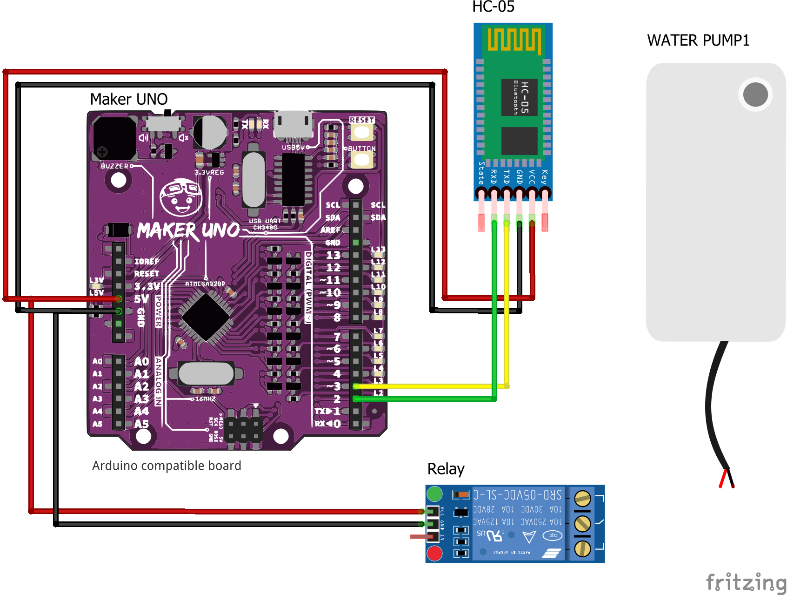

# Soil humidity monitor app

Using Arduino to read the soil humidity sensor, then send the value to the Android app using Serial connection over Bluetooth.

## Watch the demo

https://youtube.com/shorts/p8qMC-POkwc?feature=share

Also published on Cytron (for Cytron brand festival 2022)
- https://www.tiktok.com/@cytrontech/video/7157591240140131610
- https://www.instagram.com/reel/CjuceZkj4q7

## Getting started

### Hardware

#### Components needed

- [Maker UNO](https://my.cytron.io/p-maker-uno-simplifying-arduino-for-education?ref=99Y7TxrNIn6Jo) - also possible to use any Arduino
- [Bluetooth Serial Transceiver HC-05](https://my.cytron.io/p-bluetooth-serial-transceiver-hc-05?ref=99Y7TxrNIn6Jo)
- [Moisture Sensor Module](https://my.cytron.io/p-moisture-sensor-module?ref=99Y7TxrNIn6Jo&search=soil)
- [Micro Submersible Water Pump DC 3V-5V](https://my.cytron.io/p-micro-submersible-water-pump-dc-3v-5v?ref=99Y7TxrNIn6Jo)
- [Single Channel 5V Relay](https://my.cytron.io/p-single-channel-5v-relay-breakout-board?ref=99Y7TxrNIn6Jo&search=relay)
- Breadboard/jumper wires etc.

#### Code

Open `arduino/arduino.ino` file and upload the code.

_For other microcontrollers other than Arduino Uno, you may needed to change the pin etc._

#### Circuit

### Software (App)

Kindly read the readme in [soil_humidity_app](/soil_humidity_app/) folder.
